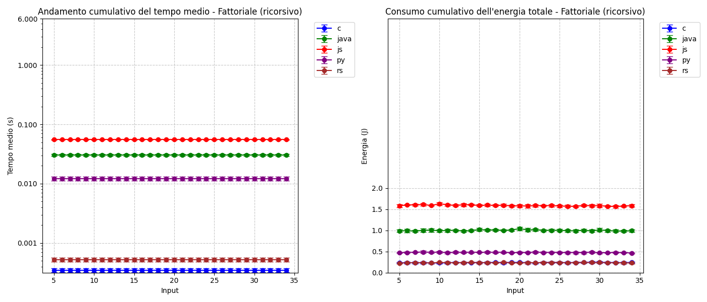

# BenchmarkProgrammLanguage

Programmazione egreen e test sul consumo energetico dei vari linguaggi di programmazione a confronto


## Indice 
* [Premessa](#premessa)
* [Installazione](#installazione)
* [Utilizzo](#utilizzo)
* [Licenza](#licenza)


## Premessa
I test sono stati basati su **kernel linux** con ambiente grafico **i3** e **cpu intel** cosi da avere a disposizione i contatori RAPL, solitamente in **(/sys/class/powercap/intel-rapl:0/energy_uj)** e un sistema molto leggero e con pochi processi attivi, dato che andremo a disattivare anche altri processi all interno dell ambiente di test.


## Installazione

### Prerequisiti
* Ubuntu 24.04.3 LTS o equivalente
* CPU intel core7 o equivalente
* Python 3.12.3
* Node.js v18.19.1
* gcc 13.3.0 (Ubuntu 13.3.0-6ubuntu2~24.04) 
* openjdk version "21.0.9" 2025-10-21
* rustc 1.91.1 (ed61e7d7e 2025-11-07)
* hyperfine 
* jq-1.7


### Passaggi
1. Installre ambiente grafico i3 linux 
   ```bash
   sudo apt install i3
   ```

2. Entrare nel ambiente i3 e rimuovere il blocco dello schermo e lo standby 
    ```bash
   xset s off
   xset dpms 0 0 0
   ```

3. rimuovere le conessioni (Facoltativo, on se si vuole riattivare ) 
   ```bash
   nmcli radio all off
   ```

4. Clona il repository:
   ```bash
   git clone [https://github.com/tuo-utente/tuo-progetto.git](https://github.com/PaoloCamedda/BenchmarkProgrammLanguage.git)
   cd BenchmarkProgrammLanguage
   chmod +x run_benchmark.sh
   ```


### Notare 
   che per lanciare tutti gli algoritmi non è possibile poiche il parametro -t ha bisogno perforza di it oppure rc oppure it,rc
   in piu si noti che il comando -N non è possibile eseguirlo per i test in python e javascript poiche lascia direttamente gli script come se fossero eseguibili compilati

## Utilizzo 
1. lanciare il comado per ottenere le informazioni 
      ```bash
      ./run_benchmark.sh -h 
   ```
   esempio
   ```bash
   ./run_benchmark.sh -r 5 -w 0 -n 5-20:5 -a fib -t rc -l py
   ```

2. se si è lanciato il comando con range di numeri non usare -a ms,qs e usare il parser   per range troverete i risultati nella cartella Results/csv altrimenti parser_single.py
   ```bash
   sudo chown -R $USER:$USER Results
   python3 parser_range.py
   ```
   

3. per visualizzare i grafici eseguire i plot a seconda di cio che si vuole ottenrere 
   ```bash
   python3 plot_range.py
   ```



## Licenza
